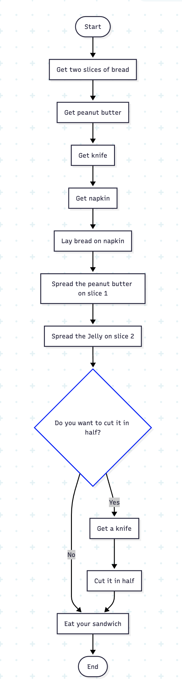

# Agentic AI Engineer

I am a self learner. I believe the best way to learn anything is to do it. Do it with passion and do it consistently everyday. This page shows my learning and experience with AI related technologies. The learning will concentrate on AI agentic. I am using python and related technologies to automate everything that can be automated. Everything will be documented for others to learn. Learning by teaching will make you smarter.

## I am taking my time

I am in no rush. I am doing this in my own pace. But the goal is to learn something everyday, document it, and share it. I am starting from the beginning ==> **meaning unlearned what I have learned to relearn in an AI atmosphere**. Who know!, may be one day I'll be teaching this stuff to a room full of students **:-)**. Learning is fun. Sharing is way more fun. The more you share, the more you learn.

## Putting all this stuff I learn by building something

I have 10 investments strategies I am running in my investment accounts. That is crazy 10 strategies. The crazy part is using AI as my assistant. That would be cool. Why 10? Well, that's for another time to discuss. Each strategy is in a separate sub account. With the learning I am acquiring here, the goal is to automate all of them using a combination of python and AI related technologies. One day my AI trader assistant will manage my trades, while I am at the beach enjoying my Piña Colada.

## Gen AI Fundamentals

---

### Day 1 - AI

#### June 26, 2025

---

**Focus**:

The focus was on understanding GenAI and its wonders **do it**.

**Progress**:

- Understanding what Generative AI is
- Understanding Different of GenAI models (small, mid size, large)
- How to work successfully with GenAI
- Understanding the practical uses of GenAI

**Thoughts**:

The lesson today was refreshing, and it is cool interacting ChatGPT. It is amazing that you can use ChaGTP as your foreign language tutor.

**Work & Resources**:

NONE

---

### Day 2 - Flow chart and algorithm

#### June 27, 2025

---

**Focus**:

The learning today was flowchart and algorithm

**Progress**:

- Understanding the importance of algorithm before starting coding
- Understanding how the use of flowchart in helping programmers organize their thoughts
- Practicing translating a requirement into an algorithm
- Practicing translating an algorithm into flowchart
- Practicing converting flowcharts into python code
- Play with mermaid to create flowchart

**Thoughts**:

The learning today was fun and refreshing. I practice using an algorithm and flowchart to make a peanut butter and jelly sandwitch. That was super cool. Programmers use tools to help them organize their thoughts before starting coding. They use visual representations to help them make complex logic easier to understanding.

**Work & Resources**:

[Flowchart tool](https://mermaid.js.org/)
 
[Flowchart codes](resources/codes/flowchart/peanut_butter_days_2.md)
 

---

---

### Day 3 - Python Basics

#### June 28, 2025

---

**Focus**:

The learning today focused on Python building block

**Progress**:

- Learning about variables, data type, operators, and syntax
- Lots of hands-on practice and experitation
- working on several small projects

**Thoughts**:

This was a nice review of the basics. Sometimes we gloss over learning the basics. It is really important to learn this part of the language well. These concepts are essential for writing clear, efficient, and structured programs. I have lots of fun playing around with variables, data types, operators, and many more today. Can't wait for tomorrow!

**Work & Resources**:

[Python visualizer](https://pythontutor.com/visualize.html#mode=edit)
 
 
[Python basics](resources/codes/python_codes/1_basics)

---

### Day 4 - Using LLM to create a python game

#### June 29, 2025

---

**Focus**:

Playing different LLM to create the python snake game

**Progress**:

- Learn and verified that LLMs are non-deterministic
- Installing and Setting up my own personal LLM locally in my computer
- Playing with llama and ChatGPT
- Using both LLMs to create the snake game in python

**Thoughts**:

I am hooked. I don't know how I can live without LLM for the rest of my time on earth. This is an amazing tool. Become better at writing prompt is an essential skill to get the best of an LLM. This is an area I need to become better at.

**Work & Resources**:

[Python Snake Game](resources/codes/python_codes/snake_game)

---

### Day 5 - Pyhton strings and collections

#### July 1, 2025

---

**Focus**:

The Focus is an introduction to Python String and collection

**Progress**:

- Understanding str, bytes, list, and dict
- Understanding the python for-loop
- Understanding the difference between mutable and immutable objects
- Work with some strings and collections's methods, and object constructors
- Work with various type of quotes
- Putting it all together through hands-project at the console

**Thoughts**:

This lesson was actually pretty fun. I got to mess around a lot in the Python REPL, trying things out and breaking stuff on purpose just to see what kind of errors I'd get. It was a great way to get a feel for how Python works. The hands-on part really helped me put what I learned into practice, and whenever I got stuck, I checked out the Python docs to figure things out.

**Work & Resources**:

NONE

---

### Day 6 - Python Modularity

#### July 2, 2025

---

**Focus**:

Python modularity

**Progress**:

- Understand the benefits of modularize your program
- Create python modules
- Importing the module you create
- Learning to create functions
- Organize python codes with functions
- Using __main__ to use python program as a script or module

**Thoughts**:

Today's lesson was concise and engaging. I had a hands-on learning experience—created a few modules, imported them using the REPL, and picked up some useful techniques along the way. I began organizing the code with functions and explored how the `__name__` special variable works when running a module directly versus importing it into another. The learning continues tomorrow.

**Work & Resources**:

[Python words program ](resources/codes/python_codes/pyfund)

---

### Day 7 - Python Modularity

#### July 3, 2025

---

**Focus**:

Python modularity (continue)

**Progress**:

- Understanding python execution model
- Work with python debugger to understand python module execution
- Refine the fetch_words python program
- Using Docstring to document the program

**Thoughts**:

Another interesting day learning Python. It was refreshing and valuable to work with the Python debugger to better understand how the execution model works. I also learned the importance of using docstrings to document my programs—something I’ll make sure to do moving forward.

**Work & Resources**:

[Python words program ](resources/codes/python_codes/pyfund)

---

### Day 8 - Python type and objects

#### July 4, 2025

---

**Focus**:

The focus today is Understanding Python type and object model

**Questions**

These are the questions that popping up in my head as I am immersing myself in the suject:
  - 1. Why knowing all this stuff important?
  - 2. How knowing all this stuff makes me a better python programmer?

**Progress**:

- What objects are
- Understand how to make use of them
- Understanding object references
- Practicing in the REPL to ciment the learning
- Answering my own questions

**Thoughts**:

I’m finally learning Python the way I always wanted to. Today’s lesson was a refreshing one. Sometimes you start with something as simple as x = 50 and number = [1, 2, 3]. Then you change things to something like x = 100, number = number2. Other times you’re getting all sorts of errors and wondering what went wrong. If I had taken the time earlier to really understand what Python is doing under the hood, it would have made a big difference.

Now, when I see **a is b**, I understand it's checking identity equality— whether two variables point to the same memory location. And when I see **a == b**, it’s testing value equality— whether the values at those memory location are the same. I now know that a and b are simply labels that serve as reference by the python language. These labels are great for human Understanding.

The learning continues tomorrow.

**Work & Resources**:

NONE

---

### Day 9 - Seeting up my computer for LLM projects

#### July 5, 2025

---

**Focus**:

The Focus today is setting up my computer for LLM works

**Progress**:

- Installing uv, the python package and project manager
- Using uv to install diffrent versions of python
- Using uv to install packages
- Installing ollama 3.2 locally
- Playround and toy around with ollama

**Thoughts**:

Today's learning experience was quite exciting. I discovered that uv is an incredible tool—with it, there's rarely a need to install Python globally on your machine. I'm dedicating significant time to mastering this tool, and it's genuinely refreshing to know I can run a large language model locally on my computer.

I created several prompts to help me learn French, which has been fascinating. Tomorrow, I plan to use Ollama to summarize a website using Python, which should be another interesting project.

**Work & Resources**:

NONE

---

### Day 10 - LLM Project that summarizes a website

#### July 6, 2025

---

**Focus**:

The focus today is using Ollama to summerize any website

**Progress**:

- Setting up the project folder
- Setting up the .env file
- Write and play around with the python code in Jupyter

**Thoughts**:

**Work & Resources**:

[LLM project - summarize a website ](resources/codes/llm/day1_ollama.ipynb)

NONE
---

### Day X - IAM Basics

#### July X, 2025

---

**Focus**:

**Progress**:

**Thoughts**:

**Work & Resources**:

NONE
