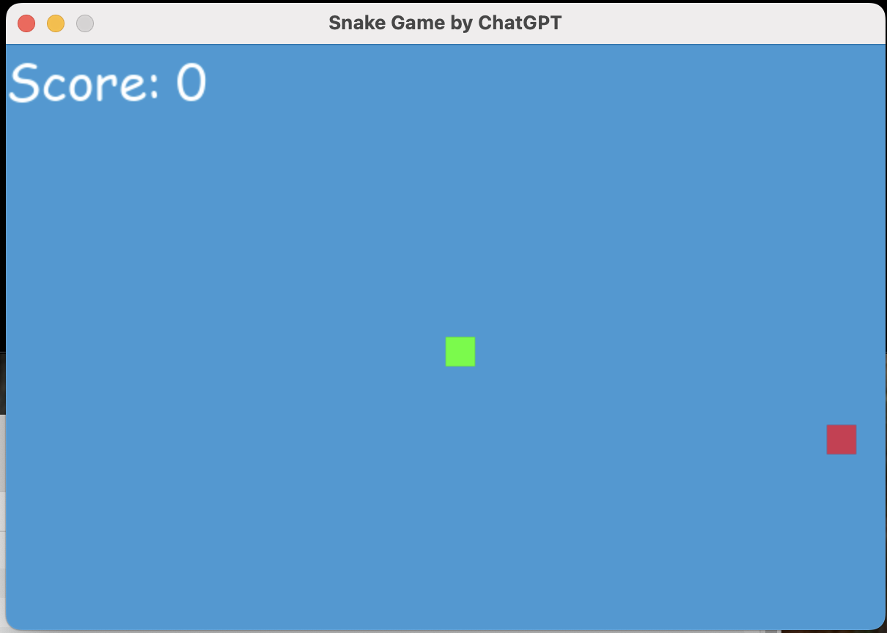
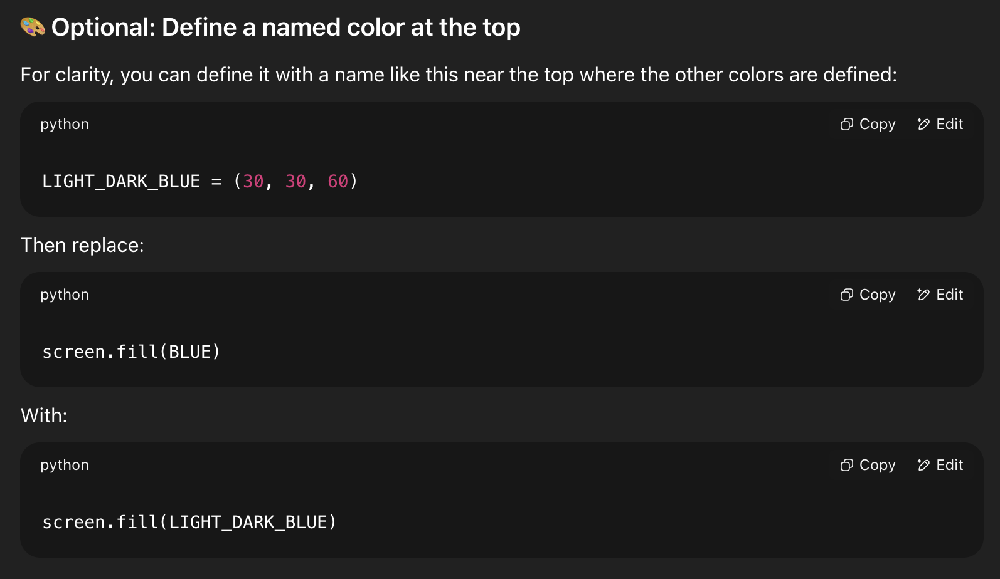
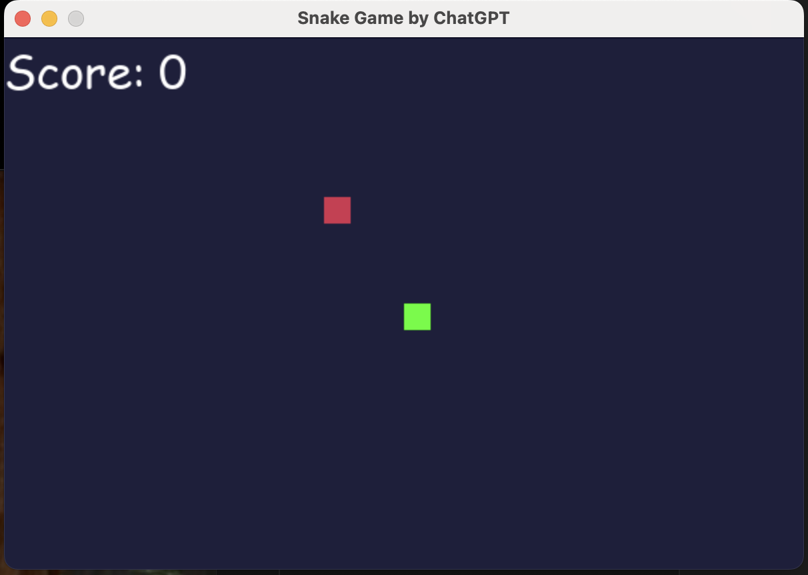
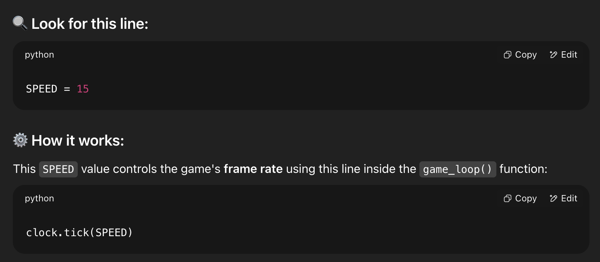

## The snake game using ChatGPT

This game was created using ChatGPT. I use the following prompt and ChatGPT generates the codes:

**Step-1**

**Prompt:** I want to create the snake game using python. Provides me with the steps to follow to create the game. Then provides me with the python code.

This prompt creates the step and also the python code. I am able to run it by simply installing the pygame package. The game provides me with a blue background, and the snake is way too fast for me. I need to work with ChatGPT to change the backgwound and adjust the speed.

**Step-2**

**Prompt:** Where in the code I can change the background color to light darkblue

Amazing ChatGPT tells exactly what I need todo and where I need to in the code to make the changes. This is super cool.

**Step-3:**

**Prompt:** Where in the code can I adjust the snake speed?

